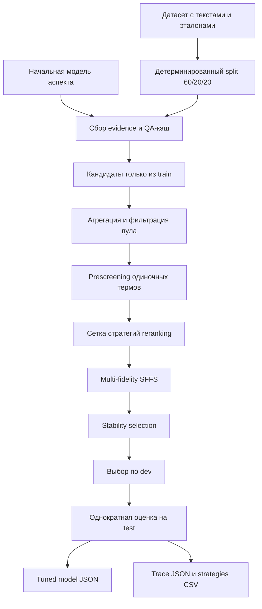

# Настройка статических ключевых слов для извлечения информации

Концептуальное описание алгоритмов извлечения и математической постановки
настройки — в [`information-extraction-concepts.md`](information-extraction-concepts.md).

## 1. Назначение

Алгоритм подбирает для тематического аспекта небольшой общий словарь ключевых
слов, который повышает качество extractive QA на коллекции документов. После
настройки словарь и выбранная стратегия переранжирования сохраняются в JSON
модели. При обычном извлечении эталонный ответ и attention-анализ конкретного
документа уже не нужны.

Поддерживаются три режима:

- `baseline` — QA по всем чанкам без ключевых слов;
- `attention` — ключевые слова строятся для каждого документа с использованием
  эталонного ответа;
- `static-keywords` — чанки переранжируются по заранее настроенному словарю.

Настройка отделяет дорогой сбор evidence от дешёвого перебора словарей. QA и
attention выполняются один раз и кэшируются; последующие запуски поиска
используют кэш ответов.

## 2. Общая схема



Основная точка входа — `scripts/05_Tune_model_keywords.py`. Реализация
распределена по модулям:

- `untie.keyword_evidence` — сбор и хранение evidence, кэш метрик, cached
  reranking;
- `untie.keyword_tuning` — split, objective, панели, SFFS и selection policies;
- `untie.keyword_training` — стратегии, prescreening, stability selection и оркестрация;
- `untie.keyword_diagnostics` — аудит pool/prescreen/SFFS/stability по сохранённым артефактам;
- `untie.extraction_metrics` — метрики извлечения;
- `untie.model_params` — схема и атомарное сохранение модели.

## 3. Входные данные

### 3.1. Английский язык

По умолчанию используется `datasets/scirex_structured.json`:

- `doc_id` — идентификатор документа;
- `original_text` — исходный текст;
- `tasks` или `tasks_cleaned` — один или несколько эталонных ответов.

Подчёркивания в `tasks` заменяются пробелами. Параметры аспекта берутся из
`model_params/scart_init_model.json`; текущий аспект — `task`, вопрос:
`Which task was solved?`.

### 3.2. Русский язык

По умолчанию используется `datasets/ruserrc_structured.csv` с разделителем
`;`:

- `id` или `doc_id`;
- `text_clean`, `original_text` или `text`;
- `Task_aspects` или `tasks_cleaned`.

Строковое представление списка эталонов разбирается через `ast.literal_eval`.
Параметры аспекта берутся из `model_params/ruserrc_init_model.json`; вопрос:
`Какая задача была решена?`.

Строки без эталонного ответа исключаются. Сейчас один запуск настраивает одно
поле модели и использует первый вопрос этого поля.

## 4. Детерминированное разделение

`deterministic_document_split` формирует train/dev/test в пропорции 60/20/20.
Документы сортируются по SHA-256 от `seed` и `doc_id`, поэтому результат:

- не зависит от порядка строк датасета;
- повторяется при том же seed;
- не допускает пересечений частей.

Назначение частей:

- **train** — единственный источник кандидатов и их морфологических форм;
- **dev** — поиск словаря и выбор стратегии;
- **test** — только финальная оценка выбранного решения.

Это принципиальная защита от leakage: слова из dev/test не могут попасть в пул
кандидатов, а test не участвует в выборе конфигурации.

## 5. Сбор evidence

Для каждого документа `collect_document_evidence` выполняет:

1. разбиение на предложения и перекрывающиеся чанки;
2. extractive QA для каждого чанка;
3. агрегацию baseline-ответа;
4. сохранение ответа, confidence и позиций span для каждого чанка;
5. вычисление матрицы семантического сходства ответов.

Только для train-документов дополнительно выполняется mining кандидатов:

1. ответы сравниваются со всеми эталонами;
2. из валидных чанков извлекаются слова с высоким attention;
3. динамический IDF-фильтр удаляет равномерно распределённые слова;
4. дубликаты объединяются по максимальному attention weight;
5. удаляются stop words;
6. сохраняются слова, которые семантически ближе к описанию аспекта, чем к
   эталонному ответу;
7. для каждого слова записываются lemma, stem, attention weight,
   score difference и индексы поддерживающих чанков.

### 5.1. Кэш и fingerprint

Evidence хранится в:

```text
{cache_dir}/{language}/field-{field_id}/evidence/
```

Fingerprint включает текст, идентификатор аспекта, вопрос, эталоны, признак
сбора кандидатов, модели, chunking, `attention_top_k` и версию пайплайна.
Изменение любого из этих параметров приводит к безопасному cache miss.

QA-кэш позволяет проверять тысячи подмножеств слов без повторного запуска
transformer-модели. Кэш не является результатом настройки и может быть удалён:
он будет построен заново.

## 6. Формирование пула кандидатов

`aggregate_candidate_pool` работает только с train evidence:

- surface forms нормализуются (`casefold`, пробелы, пунктуация);
- удаляются stop words и generic-глаголы (`strive`, `formulate`, …);
- кандидаты ниже `min_document_support` удаляются;
- при `require_chunk_support=True` (default) отбрасываются термы с
  `chunk_support_rate = 0`;
- attention и score difference агрегируются медианой по документам, что
  уменьшает влияние выбросов;
- кандидаты сортируются по document support, chunk support rate, score
  difference, attention и имени;
- размер ограничивается `max_candidates`.

Для итогового `WeightedKeyword` наиболее частая пара `(lemma, stem)` выбирается
голосованием по train-документам.

## 7. Переранжирование и стратегии

`score_chunks` ищет lemma/stem ключевых слов в чанках. Оценка учитывает:

- комбинированный вес слова;
- позицию совпадения;
- частоту совпадений;
- долю уникальных совпавших ключей.

Вес слова задаётся формулой:

```text
keyword_weight =
    attention_weight × weight_ratio
    + score_difference × (1 − weight_ratio)
```

Настройка проверяет 27 комбинаций:

1. скоринг чанков:
   - `only_score_diff` (`weight_ratio = 0`);
   - `only_weight` (`weight_ratio = 1`);
   - `equal_weight_score_diff` (`weight_ratio = 0.5`);
2. выбор кластера ответов:
   - `highest_avg_score`;
   - `weighted_score`;
   - `highest_cohesion`;
3. выбор ответа внутри кластера:
   - `highest_chunk_score`;
   - `highest_similarity`;
   - `combined_score`.

Если ни один чанк не содержит ключей, используется baseline-ответ и отмечается
`fallback=True`.

## 8. Метрики качества

Для prediction и набора эталонов вычисляются:

- `char_f1` — посимвольный F1, диапазон `[0, 1]`;
- `token_f1` — SQuAD token F1, диапазон `[0, 100]`;
- `rouge_l_f1` — ROUGE-L F1, диапазон `[0, 1]`;
- `bertscore_p`, `bertscore_r`, `bertscore_f1` — опциональные BERTScore.

При нескольких эталонах берётся максимальный результат. Внутренний composite:

```text
quality = Σ normalized_metric_weight × normalized_metric
```

`token_f1` перед объединением делится на 100. Без BERTScore три веса
перенормируются до суммы 1; с BERTScore участвуют четыре метрики.

При `--tuning-exact-match` (default ON) для objective используется пресет
`MetricWeights.exact_match()` (char/token F1 = 0.4, ROUGE-L = 0.2); BERTScore
в objective не участвует, даже если `--include-bertscore` включён.

## 9. Целевая функция

Для каждого документа вычисляется:

```text
delta = tuned_quality − baseline_quality
activation_rate = 1 − fallback_rate
harmful_fallback_rate = доля docs, где fallback=True и delta < 0
```

Базовый gain зависит от `--use-conditional-gain` (default ON):

```text
gain = mean_gain_active   # средний delta только на docs с fallback=False
     если active docs есть;
     иначе mean_gain по всем docs
```

Полная формула objective:

```text
objective =
    gain
  + activation_weight × activation_rate
  + win_rate_weight × win_rate
  + confidence_weight × bootstrap_lower_bound
  − downside_penalty × mean(max(0, −delta))
  − harm_penalty × harm_rate
  − fallback_penalty × harmful_fallback_rate
  − inactive_fallback_penalty × fallback_rate   # только для непустого subset
  − size_penalty × |keywords|
```

Bootstrap lower bound считается по `active_deltas`, если включён conditional
gain и есть active docs; иначе — по всем `deltas`.

Hard gate: для непустого subset, если `activation_rate < min_activation_rate`,
objective = −∞. Это отсекает «редкие безопасные» keywords с высоким fallback.

По умолчанию CLI (`scripts/05_Tune_model_keywords.py`) передаёт:

- `downside_penalty = 0.75`;
- `harm_penalty = 0.5`;
- `fallback_penalty = 0.1` — только **вредный** fallback;
- `inactive_fallback_penalty = 0.05` — idle fallback при непустом subset;
- `size_penalty = 0.002` (`--size-penalty`);
- `harm_threshold = 0.01`;
- `confidence_weight = 0.25`;
- `activation_weight = 0.15`;
- `min_activation_rate = 0.20`;
- `win_rate_weight = 0.10`;
- `use_conditional_gain = true`.

Таким образом, оптимизируется улучшение на active docs, стабильность,
activation rate и win rate; отдельно штрафуются ухудшения, вредный и idle
fallback, а также слишком большой словарь.

## 10. Critical и guard документы

На dev выделяются:

- **critical** — baseline quality ниже 0.65, документ содержит несколько
  чанков и хотя бы один кандидат;
- **guard** — детерминированная подвыборка хорошо обрабатываемых документов.

Critical-документы направляют поиск на реальные ошибки baseline, а guard
защищают уже правильные ответы от регрессии.

## 11. Multi-fidelity SFFS

Для каждой стратегии запускается Sequential Forward Floating Selection:

1. forward-шаг добавляет лучший кандидат;
2. successive halving продвигает лучшие варианты от малой панели к полной;
3. floating backward удаляет ставшие вредными слова;
4. поиск завершается по `max_keywords`, `evaluation_budget`, `patience` или
   сходимости.

Панели составляют примерно 25%, 50% и 100% текущей stability-подвыборки dev.
Это позволяет быстро отбрасывать слабые варианты, но подтверждать финальные
решения на большем числе документов.

Checkpoint каждого запуска сохраняется в:

```text
{cache_dir}/{language}/field-{field_id}/checkpoints/
```

Checkpoint используется только при совпадении fingerprint.

## 12. Отбор словаря после формирования pool

### 12.1 Candidate pool (только текст документов)

По умолчанию pool строится **только** из attention/QA evidence, собранного из
текста train-документов. Gold task labels **не** добавляются в pool.

- Фильтрация generic-глаголов (`strive`, `formulate`, `hypotheses`, …)
- `chunk_support_rate > 0` — терм должен матчить хотя бы один чанк
- Опциональный relaxed contrast при сборе evidence (`--relaxed-contrast`)

Опционально (не рекомендуется): `--enrich-train-references` добавляет n-grams из
train gold references. Это подмешивает task labels, а не текстовые сигналы.

### 12.2 Prescreening кандидатов

Если `--screen-before-search` (default ON), перед SFFS каждый терм из pool
оценивается по одиночке на full dev. Остаются top-`--screen-top-k` (default 40)
по `mean_gain_active`, `activation_rate`, `objective`. Термы с
`harm_rate > harm_cap` или слишком низкой predicted activation отбрасываются.
Это сокращает перебор generic-слов и оставляет бюджет для комбинаций из 2–3
ключевых слов.

### 12.3 Stability selection и политики финального отбора

SFFS повторяется `stability_runs` раз на детерминированных 80%-подвыборках dev.
После SFFS применяется политика финального отбора (`--selection-policy`):

| Политика | Поведение |
|---|---|
| `strict` | Частота выбора не ниже `--stability-threshold`, затем backward pruning |
| `relaxed` | То же, что `strict` (алиас с тем же порогом; default policy) |
| `union` | Объединение всех run-selections, затем pruning |
| `best_run` | Лучший одиночный stability run по dev rank key |
| `frequency_top_k` | Top-`max_rescue_keywords` слов по частоте выбора в runs |

Политики `strict` и `relaxed` в текущей реализации эквивалентны: обе вызывают
`stability_selection` с порогом `--stability-threshold` (default 0.4).

**Non-empty rescue guard** (`--require-non-empty`, по умолчанию включён):
финальный набор выбирается в порядке приоритета:

1. stable subset, если проходит `activation_acceptable`;
2. иначе лучший кандидат из rescue pool с `activation_acceptable`;
3. иначе лучший кандидат по rank key (`mean_gain_active`, `activation_rate`,
   `harm_rate`, `objective`), если `--require-non-empty`;
4. при необходимости subset дополняется до `--min-keywords`.

`activation_acceptable` для непустого subset:

```text
activation_rate >= min_activation_rate
and mean_gain_active >= −0.01
and harm_rate <= harm_cap
```

Rescue pool включает stable subset, union всех run-selections, результаты
отдельных runs/SFFS и одиночные термы из top prescreen.

После stability selection выполняется backward pruning на полном dev. Лучшая
стратегия выбирается лексикографически по `mean_gain_active`, `activation_rate`,
меньшему `harm_rate`, затем `objective` и имени стратегии.

## 13. Финальная test-оценка и ablation

После выбора словаря и стратегии test используется один раз. Сравниваются:

- `empty_baseline` — пустой словарь;
- `frequency_only` — верхние слова по частоте/support;
- `floating_tuned` — результат SFFS и stability selection.

`release_recommended` устанавливается, если:

```text
test_mean_gain > 0
and test_activation_rate >= min_activation_rate
and test_win_rate >= test_loss_rate
and test_harm_rate <= harm_cap
and test_confidence_lower_bound >= 0
```

Пороги `min_activation_rate` и `harm_cap` берутся из параметров запуска
(default 0.20 и 0.12). Флаг является автоматическим gate, а не гарантией
production-качества.

## 14. Сохранение модели

Начальный JSON не изменяется. Создаётся глубокая копия, где у выбранного поля:

- `keywords` — упорядоченный список слов;
- `keyword_metadata` — lemma, stem, attention weight, score difference,
  document support, selection frequency и marginal gain;
- `tuning_metadata` — стратегия, dev/test показатели, stability, split hash,
  ablations, fingerprint и release flag.

`save_model_params_atomic` пишет временный файл и заменяет destination только
после успешной сериализации. Неизвестные vendor-поля модели сохраняются.
Legacy-ключи в виде объектов также поддерживаются при чтении.

Дополнительные артефакты:

- `*.tuning.json` — полный trace настройки;
- `*.tuning.strategies.csv` — сравнение стратегий;
- `extraction_metrics.json` — кэш метрик prediction/reference.

## 15. Запуск

Полный английский прогон:

```bash
python scripts/05_Tune_model_keywords.py \
  --language en \
  --include-bertscore
```

Полный русский прогон:

```bash
python scripts/05_Tune_model_keywords.py \
  --language ru \
  --include-bertscore
```

При default `--tuning-exact-match` флаг `--include-bertscore` не влияет на
objective tuning (BERTScore включается только с `--no-tuning-exact-match`).

Быстрая проверка одной стратегии на подвыборке:

```bash
python scripts/05_Tune_model_keywords.py \
  --language en \
  --limit 20 \
  --max-candidates 20 \
  --max-keywords 5 \
  --evaluation-budget 30 \
  --stability-runs 2 \
  --strategy equal_weight_score_diff weighted_score combined_score \
  --output artifacts/scart_tuned_demo.json
```

`--strategy` можно повторить несколько раз. В этом случае настройка проверит
только перечисленные комбинации и выберет лучшую по dev objective:

```bash
python scripts/05_Tune_model_keywords.py \
  --language en \
  --strategy equal_weight_score_diff weighted_score combined_score \
  --strategy only_score_diff highest_avg_score highest_similarity
```

Inference после настройки:

```bash
python -m untie.cli article.txt \
  --language en \
  --mode static-keywords \
  --model-params model_params/scart_tuned_model.json \
  --question "Which task was solved?"
```

Готовые shell-профили для полных EN-прогонов (text-only pool, без enrichment):

- `scripts/run_en_text_only_v4.sh` — словарь до 8 keywords, `union` policy;
- `scripts/run_en_text_only_v5.sh` — relaxed filtering, до 10 keywords,
  `min-keywords 6`;
- `scripts/run_en_large_dict_v3.sh` — профиль `full_large` с `min-keywords 4`.

Все профили пишут артефакты в
`experiments/analysis_results/keyword_tuning_task/en/` и переиспользуют evidence
из `artifacts/keyword_tuning_notebooks`.

## 16. Основные параметры

| Параметр | Default | Значение |
|---|---:|---|
| `--language` | en | язык датасета и модели |
| `--field-id` | первое поле | какое поле модели настраивать |
| `--cache-dir` | `artifacts/keyword_tuning_cache` | evidence, checkpoints, metrics |
| `--output` | `model_params/scart_tuned_model.json` / `model_params/ruserrc_tuned_model.json` | tuned model JSON |
| `--trace` | `{output}.tuning.json` | полный trace настройки |
| `--seed` | 42 | split, bootstrap, панели |
| `--attention-top-k` | 100 | attention-кандидаты из чанка |
| `--min-document-support` | 2 | минимум train-документов |
| `--max-candidates` | 150 | максимальный пул |
| `--max-keywords` | 20 | максимальный словарь |
| `--evaluation-budget` | 250 | evaluations на SFFS run |
| `--patience` | 2 | шаги без улучшения |
| `--beam-width` | 5 | ширина forward beam |
| `--stability-runs` | 5 | число повторов |
| `--stability-threshold` | 0.4 | минимальная частота выбора (`strict`/`relaxed`) |
| `--selection-policy` | relaxed | политика финального отбора |
| `--require-non-empty` | true | не возвращать пустой словарь, если есть лучший кандидат |
| `--harm-cap` | 0.12 | максимальный harm rate для prescreen, rescue и release gate |
| `--activation-weight` | 0.15 | бонус за activation rate (1 − fallback) |
| `--min-activation-rate` | 0.20 | hard gate: минимальная доля active docs |
| `--inactive-fallback-penalty` | 0.05 | штраф idle fallback при непустом subset |
| `--use-conditional-gain` | true | mean_gain только на active docs |
| `--win-rate-weight` | 0.10 | бонус за долю docs с delta > harm_threshold |
| `--size-penalty` | 0.002 | штраф за размер словаря в objective |
| `--min-enriched-support` | 8 | минимальный document_support для enriched terms |
| `--max-rescue-keywords` | 5 | максимум терминов в rescue/frequency fallback |
| `--min-keywords` | 1 | нижняя граница backward pruning (для `full_large` — 4) |
| `--screen-before-search` | true | prescreening перед SFFS |
| `--screen-top-k` | 40 | число кандидатов после prescreening |
| `--tuning-exact-match` | true | exact-match веса для tuning objective |
| `--enrich-train-references` | false | добавлять train gold n-grams в pool (не рекомендуется) |
| `--relaxed-contrast` | true | мягкий contrast при сборе evidence |
| `--include-bertscore` | false | включить BERTScore в objective (если `--no-tuning-exact-match`) |
| `--chunk-max-tokens` | EN 384 / RU 128 | размер чанка |
| `--overlap-tokens` | EN 50 / RU 24 | перекрытие чанков |
| `--limit` | — | ограничить число строк датасета до split |
| `--device` | auto | устройство для transformer-моделей |
| `--log-level` | INFO | уровень логирования |

Для RU по умолчанию используются чанки 128/24, для EN — 384/50.

## 17. Ограничения и диагностика

- Полный grid `27 × stability_runs × evaluation_budget` может выполняться
  много часов; начинать следует с sample-режима.
- BERTScore заметно увеличивает время и требует optional-зависимостей.
- RU tuning требует `pymorphy3`; sentence encoder может потребовать заранее
  скачанные веса.
- При `Candidate pool is empty` следует увеличить выборку, снизить
  `min_document_support` или проверить attention/валидацию.
- `stop_reason=evaluation_budget` означает корректную, но потенциально
  незавершённую оптимизацию.
- Изменение модели, вопроса, chunking или датасета инвалидирует evidence-кэш.
- `--limit` берёт первые строки до split и может менять распределение данных.
- Regex matching lemma/stem ограниченно работает для дефисных и составных
  терминов.
- Модуль `untie.keyword_diagnostics` и ноутбук
  `08_Keyword_tuning_diagnostics_en.ipynb` позволяют разобрать funnel
  pool → prescreen → SFFS → stability по сохранённым evidence и trace без
  повторного tuning.

## 18. Ноутбуки

**Tuning (полный pipeline):**

- `experiments/notebooks/06_Keyword_tuning_task_en.ipynb`;
- `experiments/notebooks/07_Keyword_tuning_task_ru.ipynb`.

Ноутбуки 06 и 07 имеют режимы `sample` и `full`, показывают progress bars,
диагностику настройки, сохраняют отдельную tuned-модель и сравнивают baseline
с `static-keywords` на held-out test. Результаты записываются в
`experiments/analysis_results/keyword_tuning_task/{en,ru}`.

**Diagnostics (без повторного tuning):**

- `experiments/notebooks/08_Keyword_tuning_diagnostics_en.ipynb` — пошаговая
  визуализация pool/prescreen/SFFS/stability по evidence-кэшу и
  `*.tuning.json`.
